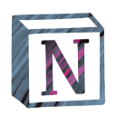

 

  

 

# Notion-Plus-Icon

 

[![changelog][changelog-badge]][changelog]
[![tutorials][tutorials-badge]][tutorials]
[![license][license-badge]][license]

🚀 It is convenient to use icons in notion。

 

## features
- [X] Caching links and upload icons for next use.

  - Uploaded icons can only be used for the current page and the cache will expire after a period of time because of Notion.

- [ ] icons library

[license]: ./LICENSE
[tutorials]: https://www.notion.so/yeseth/NOTION-PLUS-ICON-Tutorials-8e54d0957eb54938a0bed501a0374cd4
[changelog]: https://www.notion.so/yeseth/NOTION-PLUS-ICON-Changelog-647c37f1a7e045b2839735bb02a7b28a

[Tutorials]: https://www.notion.so/yeseth/NOTION-PLUS-ICON-Tutorials-8e54d0957eb54938a0bed501a0374cd4
[Changelog]: https://www.notion.so/yeseth/NOTION-PLUS-ICON-Changelog-647c37f1a7e045b2839735bb02a7b28a

[license-badge]: https://img.shields.io/badge/license-MIT-blue
[changelog-badge]: https://img.shields.io/badge/changelog-brightgreen
[tutorials-badge]: https://img.shields.io/badge/tutorials-brightgreen

